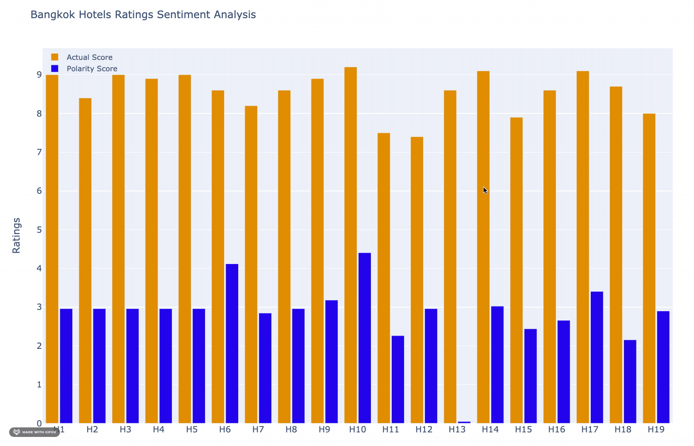

# Analyzing reviews of hotels from Booking.com
This project was part of CS-2376, Data Mining and Warehousing.


Use scraper.py to mine data of hotels from Booking.com by providing the name of the city you want the data for.\
\
Then, use NLTP library to analyse the comments for each hotel and provide a polarity score to it. \
Visualise the results by running sentiment.py in the form of bar graphs.\



Go inside map-box folder and launch the application. \
```npm start ``` \
It geospatially locate the top 10 hotels of a particular location based on the polarity score calculated for each hotel. We used Mapbox API to locate the hotels.\


